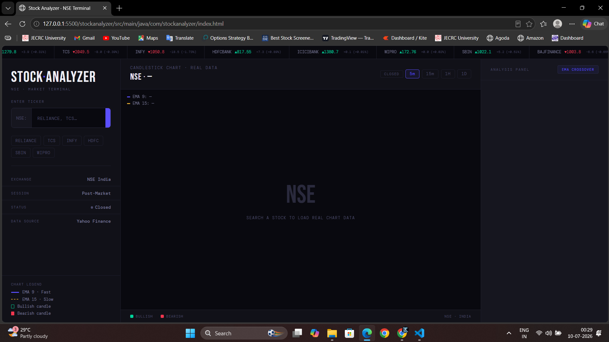

# 📈 Stock Analyzer

A Java-based Stock Market Analyzer that fetches real-time NSE stock data from Yahoo Finance, calculates Exponential Moving Averages (EMA), and generates Buy, Sell, or Hold recommendations through an interactive web interface.

---

## 📸 Project Preview

### Home Screen



### Stock Analysis


---

## 🚀 Features

- 📊 Real-time NSE stock market analysis
- 📈 Interactive candlestick chart
- ⚡ EMA (9 & EMA 15) crossover strategy
- 🟢 Buy / 🔴 Sell / 🟡 Hold recommendation
- 💹 Live market price, daily high & low
- 🌐 Yahoo Finance API integration
- ⚙️ Java HTTP Server backend
- 🎨 Responsive HTML, CSS & JavaScript frontend

---

## 🛠 Tech Stack

### Backend
- Java 17
- Java HTTP Server
- Maven

### Frontend
- HTML5
- CSS3
- JavaScript

### APIs
- Yahoo Finance API

### Concepts Used
- Exponential Moving Average (EMA)
- Candlestick Charts
- Technical Analysis
- REST API Communication
- Object-Oriented Programming (OOP)

---

## 📂 Project Structure

```text
Stock-Analyzer/
│
├── src/
│   ├── main/
│   └── test/
│
├── screenshots/
│
├── docs/
│
├── assets/
│
├── pom.xml
├── .gitignore
└── README.md
```

---

## ▶️ How to Run

### Clone the Repository

```bash
git clone https://github.com/Kanishk-krnwt/Stock-Analyzer.git
```

### Open the Project

Open the project in VS Code or IntelliJ IDEA.

### Install Dependencies

```bash
mvn clean install
```

### Run the Backend

```bash
mvn exec:java
```

### Open the Frontend

Open:

```
src/main/java/com/stockanalyzer/index.html
```

in your browser.

---

## 📊 Future Improvements

- 🤖 Automated Trading using Broker APIs
- 💼 Portfolio Management Dashboard
- ⭐ Stock Watchlist
- 🔔 Price Alerts & Notifications
- ☁️ AWS Cloud Deployment
- 📱 Mobile Responsive Dashboard

---

## 👨‍💻 Author

**Kanishk Karnawat**

Cloud Computing Engineer | AI Engineer | Java Developer

GitHub: https://github.com/Kanishk-krnwt
